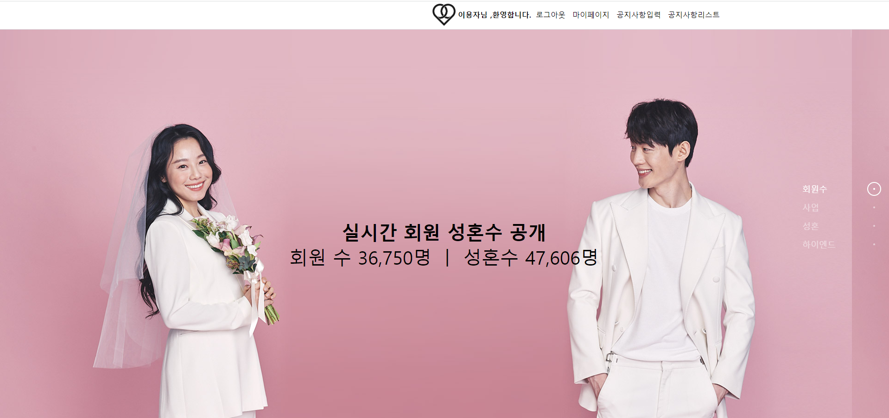
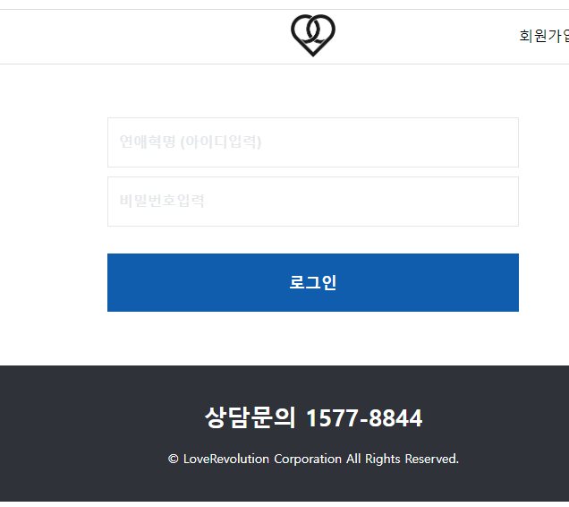
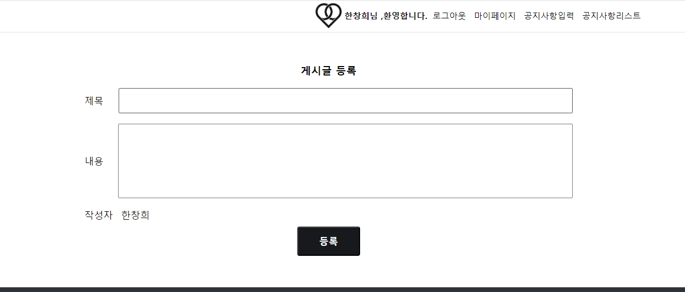
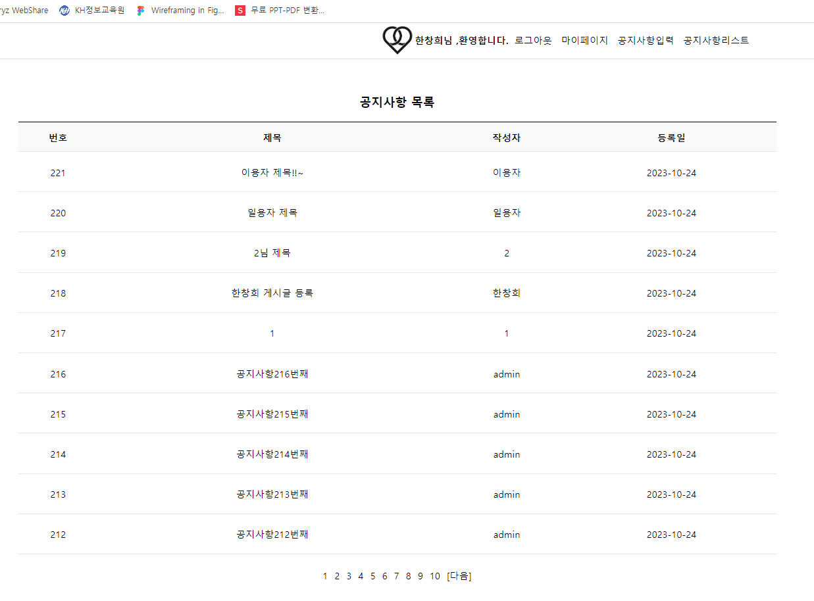
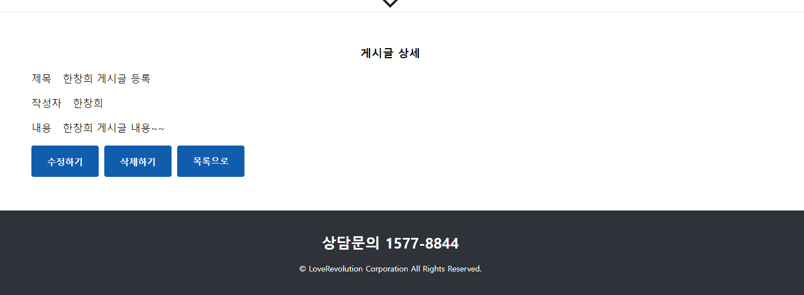

# LoveRevolution
연애혁명 - 파이널프로젝트

<h3>프로젝트 목적<h3>

요즘 같이 여건상 이성을 만나기 힘든 사람들에게 서비스를 해보고자 구상해 보았다.

<h3>개발 기간</h3>

2023.10.09 ~ 2023.10.25

<h3>개발 목표</h3>

✔ 기존 사이트와는 다르게 직관적이지 않은 UI

✔ 기존 사이트와는 다르게 메뉴들이 한 눈에 들어오게 함

<h3>주요기능</h3>

	✔ 회원관리(회원가입, 수정, 탈퇴, 마이페이지)  
	✔ 공지사항 게시판(공지사항입력, 공지사항리스트, 공지사항 수정, 공지사항 삭제)  

<h3>연애혁명 주요화면 살펴보기</h3>
<h4>1.메인화면</h4>

<h4>2.로그인화면</h4>

<h4>3.공지사항 입력</h4>

<h4>4.공지사항 리스트</h4>

<h4>5.공지사항 상세</h4>

<h3>프로젝트 회고</h3>

파이널프로젝트여서 이전에 배웟던 내용을 내 프로젝트에서도 적용할 수 있는 기회가 되었습니다.

